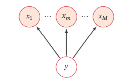
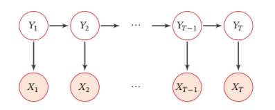
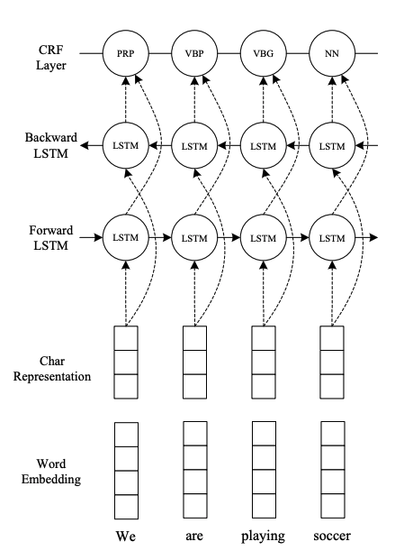
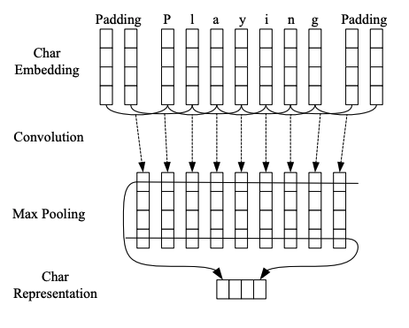

# 序列标注

根据上下文内容进行标注分类

## 概述

### 主要方法

1. 基于规则与词典
2. 基于统计机器学习
3. 面向开放域

HMM : 生成式模型

CRF : 联合概率分布, 优化整个序列, 效果明显优于HMM

LSTM : 编码能力强, 但无法考虑特定语义关系

### 应用

1. 词性标注
2. 命名实体识别
3. 句法分析
4. 语义角色识别
5. 关键词抽取
6. 问答

## 图模型

- 概率图模型 : 
  - 有向图 - 贝叶斯网 : 隐马尔科夫模型, 朴素贝叶斯分类器
  - 无向图 - 马尔科夫网 : 条件随机场

### 有向图

有向图具有局部马尔科夫性质 : 给定父节点吼, 该节点条件独立于非后代节点

#### 朴素贝叶斯分类器

给定 $Y, X_{1},...X_{M}$之间相互独立, 条件概率$p(y|x)$ 可分解为:

$$p(y|x;\theta) = p(y|\theta_{c})\prod_{m=1}^{M}p(x_{m}|y_{m};\theta_{m})$$

$\theta_{c}$ 是 $y$ 的先验分布概率参数, $\theta_{m}$ 是条件概率分布 $p(x_{m}|y,\theta_{m})$ 的参数。

若 $x_m$ 为连续值, $p(x_{m}|y,\theta_{m})$ 可以用高斯分布建模。

若 $x_m$ 为离散值, $p(x_{m}|y,\theta_{m})$ 可以用多项分布建模。

#### 隐马尔科夫模型 (HMM)

**马尔科夫链:** 下一时刻状态仅由当前时刻决定

条件概率: 

$$p(x,y;\theta) = p(y_{1})p(x_1|y_{1})\prod_{2}^{N}p(y_{i}|y_{i-1})p(x_{i}|y_{i})$$

- 参数 $\lambda = [\pi, A, B]$:
  - 状态转移矩阵 $A = [a_{ij}]$, $a_{ij} = p(y_{i}|y_{i-1})$
  - 输出观测矩阵 $B = [b_{ij}]$, $b_{ij} = p(x_{i}|y_{i})$
  - 初试状态矩阵 $\pi = (\pi_1,\pi_2,...\pi_N)$,  $\pi_i = p(y_{1})$

- **三种Task**:
  - 计算观测序列: 已知$\{x_1,x_2,...x_{n-1}\}$ 求 {x_n}
  - 已知观测求状态: 语音识别 $x_n$为语音信息,$y_n$为文字信息
  - 训练参数$\lambda$

### 无向图

#### 条件随机场 (CRF)

直接建模条件概率的无向图模型

CRF详细推导[戳这里~](https://www.cnblogs.com/createMoMo/p/7529885.html)

在序列标注任务中, 可应用CRF根据统计规则及概率转移限制LSTM的结果。

CRF将 **转移特征函数** (对应 Transition Score) 与 **状态特征矩阵** (对应Emssion Score, 其值来自于BILSTM) 作为参数进行训练。训练过程需应用动态规划-**Viterbi算法**

## 应用模型

### BILSTM-CNN-CRF

#### 论文链接

[End-to-end Sequence Labeling via Bi-directional LSTM-CNNs-CRF](https://arxiv.org/pdf/1603.01354.pdf)

#### 模型结构

**Char Embedding**

应用 CNN 计算 character-level representation. CNN 在捕捉形态信息 (Morphological information) 方向很有效.

Embedding = Character embedding + Word embedding

Word Embedding 可保持多重语义信息, Randomly Initialize embedding + Pretrained embedding, 即保持全局语义信息, 又针对具体任务进行调整。

**BILSTM**

学习双向语义信息。

**CRF**

LSTM $H_t$ 在标签无依赖条件下有效, 无法考虑标签间的相互关系。

对于一个序列 CRF 模型(只考虑两个连续标签之间的交互), 采用 **Viterbi算法**可以有效地解决训练和解码问题。
