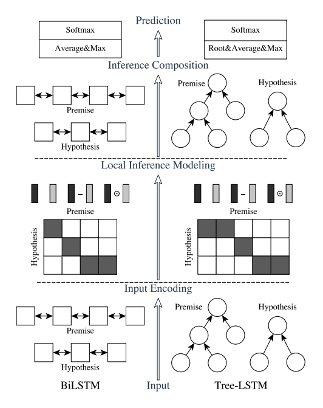

# 文本匹配

## 概述

### 分类

- 根据监督信号可分为 :
  - 文本语义相似度 : 语义相似度模型
  - 检索后的点击行为 : 行为相关性模型

- 根据 Query 及 document 的数量可分为 
  - Pointwise : one p - one d
  - Pairwise : one p - two d
  - Listwise : one p - multi d

### 应用

1. 文本相似度匹配
2. 问答匹配 : Ranking Question, 多Answer的排序问题
3. 对话匹配 : 需考虑多轮信息
4. 自然语言推理/文本蕴含 : [A]前提 (premise) -[B]假设 (hypothesis) ? Relation : (entailment / contradiction / neutral)
5. 信息检索中的匹配问题 : 匹配可看做Selection, 更重要的是 Ranking

## 应用模型

### ESIM

#### 论文链接

[Enhanced LSTM for Natural Language Inference](https://arxiv.org/pdf/1609.06038v3.pdf)

#### 模型结构

左: ESIM (BILSTM) 

右: HIM (Tree-LSTM)

HIM = Parsing Information + ESIM

**Input Encoding**

BILSTM + Mask Padding

- tips: 
    - 在 NLI 任务中 LSTM 优于 GRU
    - Embedding = Randomly initialize embedding + Pretrained embedding
    即考虑全局语义信息，同时针对任务进行Fine-tune
    - 树结构中的 L、R 方向代表左右子节点

**Local Inference Modeling**

方式: Subsentential Inference 小句推理

- Previous Method: 
  - Soft-Attention, 只考虑 Word-embedding 未考虑 Context, Bag-of-word-embedding A和B之间应用 Intra-Attention
  - Distance-sensitive Intra-Attention, 根据词间距计算词级别的 Context关系。

ESIM: Softmax-Multi-Attention 

***HIM 与 ESIM 对比 : Tree Parise 与 BILSTM Attention关注点存在差异。***

- Tips: 
  - 在计算 $\alpha$ 前针对 hidden 应用 MLP(多层感知机)对计算Attention帮助不大, 因 BILSTM已很好的学到表示信息。
  - 多重组合 attn-information: 锐化元素间的局部推理信息, 并捕获矛盾信息

**Inference Composition**

BILSTM 

- Tips:
  - 在BILSTM 前应用 one-layer FNN-Relu: 控制模型复杂性,减少模型参数防止过拟合

**Prediction**

- Tips:
  - 池化方式选择mean pool 以及 max pool, 不适用求和方式因求和对序列长度敏感鲁棒性差。
  - MLP 激活函数 Tanh、Softmax (Padding-mask)

#### 未来发展

1. 可探索更多的外部资源
2. 增加词级推理覆盖面
3. 加强模型建设，进行矛盾检测